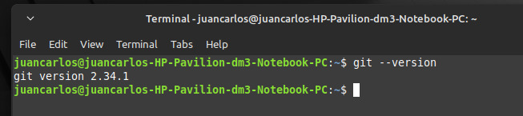
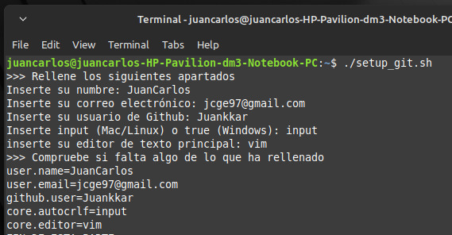
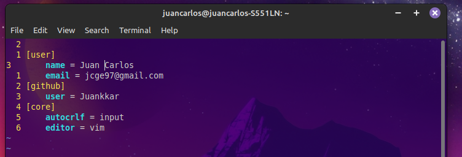
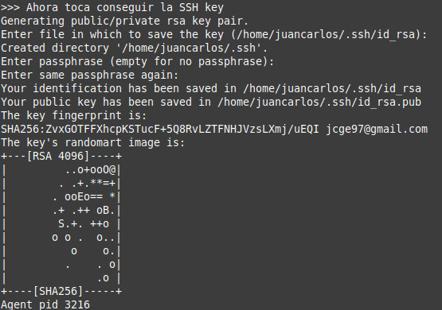
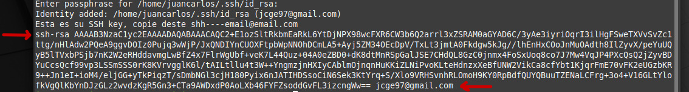
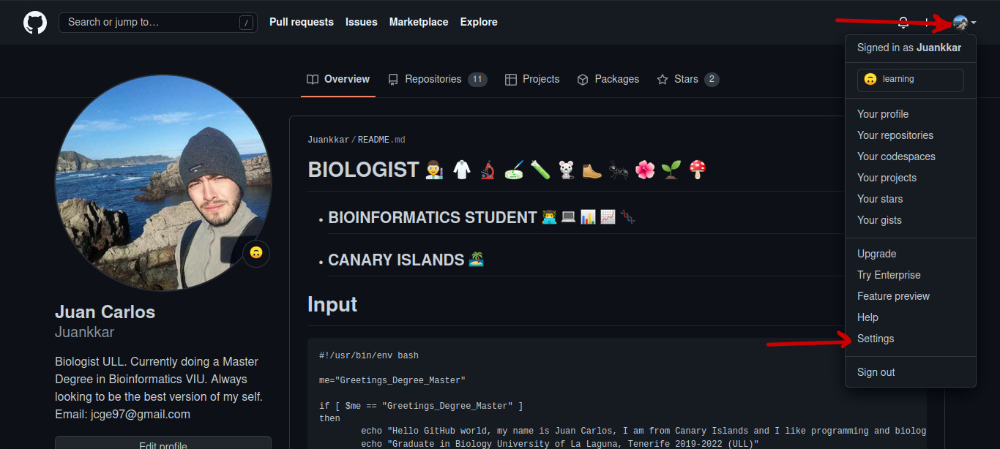
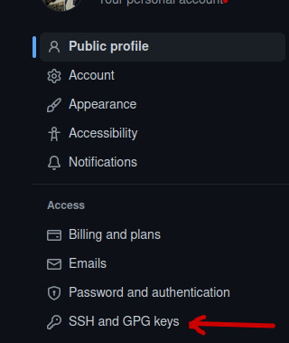
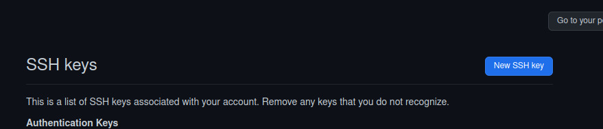
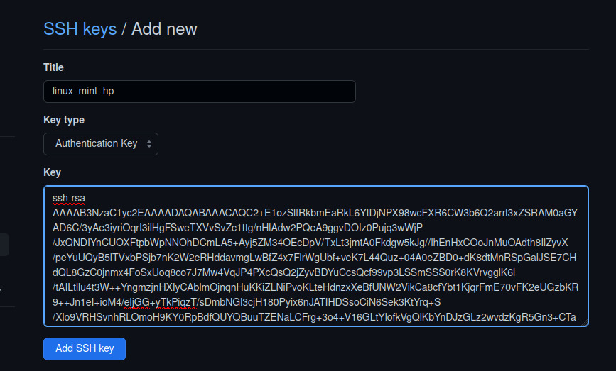

# **SET-UP para poder interactuar entre mi ordenador local y mi cuenta de GitHub.**

### Script con el programa: **[setup_git.sh](code/setup_git.sh)**

### Si te va bien y quieres ver para que sirve esto, tengo un repositorio donde comento los comandos básicos que conozco de ```git```, se llama: **[Git_iris](https://github.com/Juankkar/Git_Iris)**

Lo que este hace es:

1) Insertar en tu ordenador tus 
***credenciales*** para tu cuenta de GitHub.

2) Obtención de la ***SSH key***. La idea de esta llave es crear una "passphrase" (cotraseña, pero no de tu cuenta de GitHub), para poder clonar, modificar, y guardar cambios que se hagan a un repositorio de forma remota a tu cuenta. Es decir, trabajar en un repositorio de GitHub desde la terminal/editor de texto desde tu ordenador local.

**El script está hecho de tal manera de que al correrlo te va a ir pidiendo todo lo necesario**. En principio no haría falta modificar nada, a mí me ha ido bien.

## Pasos a seguir:

### 1) Ver si tienes instalado el comando de git:

```
git --version
```

Si te sale un error lo instalas

```
sudo apt install git # yum en centOS, dnf fedora...
```
Una vez lo tengas instalados miras de nuevo ```git --version```, te debería salir esto:

<p align="center">
    
</p>

### 2) Lo siguiente finalmente es correr el script (```./setup_git```).

Te recomiendo que copies el script en sí en tu usuario del home, para correrlo ahí. De todas formas no debería haber mayor porblema si no haces esto.

2.1) La primera parte del script consiste en relleganr tus credenciale en el siguiente orden:

* Tu nombre.
* Tu correo electrónico.
* Tu usuario de GitHub.
* Cómo git maneja las terminaciones de líneas.
* El editor de texto básico que usarás.

De esta manera mostraré un ejemplo con mis credenciales. Hasta donde tengo entendido **Juan Carlos soy yo**, pon tus propias credenciales.

<p align="center">
    
</p>

**En caso de algún fallo con este apartado puedes luego de conseguir la SSH key modificarlo manualmente con el siguiente comando:**

```
git config --global --edit
```

Digamos que mi nombre va separado y lo quiero cambiar (***al rellenar el script no puedes dejar espacios***):

<p align="center">
    
</p>

2.2) La segunda parte consiste en crear la SHH key, para ello sólo tienes que realizar lo que se te pide de nuevo, lo he divido en dos partes:

1) En la primera parte, a partir de "Ahora toca conseguir la SHH key" hasta el símbolo ese extraño. Tienes que tener en cuenta la parte que dice:  
"***Enter de file wich you want save the key***" Dale simplemente a enter en esa ruta del home.Lo siguiente es la ***"passphrase"***, la contraseña que te pedirá cuando uses ciertos comandos de git: ```git pull```, ```git push```, ```git clone```...

<p align="center">
    
</p>

2) Después de ese símbolo raro te va a pedir esta vez que insertes la passphrase que has creado. Y te pritará el resultado de tu key: tienes que copiarlo (ratón) desde **flecha roja**-**flecha roja**. Si no se ve bien, es desde shh-rsa---tuemail@email.com

<p align="center">
    
</p>

* Lo siguiente es ir a los settings de tu cuenta de GitHub.

<p align="center">
    
</p>

* Vas al apartado de SHH keys and GPG

<p align="center">
    
</p>

* Le das **New SSH key**

<p align="center">
    
</p>

* Y finalmente le asignas un nombrea tu llave y pegas el resultado que copiaste del script. 

<p align="center">
    
</p>


Y con esto ya debería aparecerte como resultado en SHH and GPG keys una de estas, si no te saldrá un mensaje en rojo arriba de que hay algo mal. 

He de decir que la key esta no pude comprobar que me salió bien ya que lo probé en un ordenador viejo y la darle al Add SSH key mi ordenador estalló (era uno de estps viejos con linux mint). Pero otros dos, me ido perfecto y se me han generado bien.

